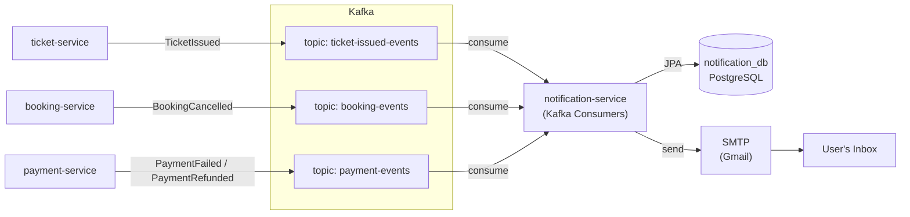

# Notification Service — Design Document

## Overview

`notification-service` is an **async email notification hub**. It consumes Kafka events from other services (ticket issuance, booking cancellation, payment failures/refunds), renders email content from templates, and delivers via SMTP (with fallback to logging). It is intentionally stateless in its processing logic but persists notification history for audit and retry.

---

## Architecture



---

## Domain Model

### `EmailNotification`

| Field | Type | Description |
|-------|------|-------------|
| `id` | Long | Primary key |
| `userId` | Long | Reference to auth user (nullable for payment events) |
| `bookingId` | Long | Related booking (nullable) |
| `paymentId` | Long | Related payment (nullable) |
| `recipientEmail` | String | Target email address |
| `subject` | String | Email subject line |
| `content` | String | Email body (plain text) |
| `ticketCodes` | String | Comma-separated ticket codes (for ticket emails) |
| `dedupKey` | String | Unique constraint: `{TYPE}-{referenceId}` |
| `provider` | String | `SMTP` or `LOG` |
| `notificationType` | NotificationType | `TICKET_ISSUED`, `BOOKING_CANCELLED`, `PAYMENT_FAILED`, `PAYMENT_REFUNDED` |
| `status` | Status | `PENDING`, `SENT`, `FAILED`, `LOGGED` |
| `errorMessage` | String | SMTP error details |
| `sentAt` | Instant | When delivery completed |
| `createdAt` | Instant | When record was created |

### `NotificationType` (Enum)

- `TICKET_ISSUED` — Tickets successfully issued after payment
- `BOOKING_CANCELLED` — Booking was cancelled by user or organizer
- `PAYMENT_FAILED` — Payment attempt failed
- `PAYMENT_REFUNDED` — Refund processed for a cancelled booking

---

## Kafka Integration

### Consumer: `TicketIssuedConsumer`

- **Topic:** `ticket-issued-events`
- **Group ID:** `notification-service`
- **Message:** `TicketsIssuedEventMessage`
- **Handler:** `NotificationService.handleTicketsIssued()`

### Consumer: `BookingEventsConsumer`

- **Topic:** `booking-events`
- **Group ID:** `notification-service`
- **Message:** `BookingEventMessage`
- **Filter:** Only `eventType == "BookingCancelled"`
- **Handler:** `NotificationService.handleBookingCancelled()`

### Consumer: `PaymentEventsConsumer`

- **Topic:** `payment-events`
- **Group ID:** `notification-service`
- **Message:** `PaymentEventMessage`
- **Filter:** `eventType == "PaymentFailed"` or `"PaymentRefunded"`
- **Handler:** `NotificationService.handlePaymentFailed()` / `handlePaymentRefunded()`

**Note:** `PaymentSucceeded` is intentionally ignored here (handled by booking-service).

---

## Service Layer

### `NotificationService`

| Method | Trigger | Description |
|--------|---------|-------------|
| `handleTicketsIssued(...)` | `TicketIssuedConsumer` | Render and send ticket confirmation email |
| `handleBookingCancelled(...)` | `BookingEventsConsumer` | Render and send cancellation email |
| `handlePaymentFailed(...)` | `PaymentEventsConsumer` | Render and send payment failure notice |
| `handlePaymentRefunded(...)` | `PaymentEventsConsumer` | Render and send refund confirmation |

### Processing Flow

1. **Validate:** Skip if `bookingId` / `paymentId` is null
2. **Dedup key:** `TICKET_ISSUED-{bookingId}`, `BOOKING_CANCELLED-{bookingId}`, etc.
3. **Idempotency check:** Query `EmailNotification` by `dedupKey`
   - If exists and status is `SENT` or `LOGGED` → skip
   - If exists and status is `FAILED` → retry (reset to `PENDING`)
   - If not exists → create new `PENDING` record
4. **Render:** Call `NotificationTemplate.render(type, context)`
5. **Deliver:**
   - If `mailEnabled=true` and `JavaMailSender` available and email not blank → send SMTP
   - Else → mark as `LOGGED` (for local/dev testing without real SMTP)
6. **Update status:** `SENT` / `FAILED` / `LOGGED`

### Retry Behavior

- Kafka consumer auto-retries on exception (Spring Kafka default)
- On retry, `getOrCreateNotification()` detects the existing `FAILED` record, resets it to `PENDING`, and attempts delivery again
- No dead-letter queue is configured; retries continue until Kafka offset commits

---

## Email Templates

### `NotificationTemplate`

Template-driven builder using simple string interpolation. Each `NotificationType` has:
- Subject template
- Body template (plain text)

| Type | Subject | Body Context |
|------|---------|--------------|
| `TICKET_ISSUED` | `Vé điện tử của bạn — {eventTitle}` | `eventTitle`, `ticketCodes` (list) |
| `BOOKING_CANCELLED` | `Booking đã bị huỷ — {eventTitle}` | `eventTitle`, `reason` |
| `PAYMENT_FAILED` | `Thanh toán thất bại — {eventTitle}` | `amount`, `eventTitle`, `reason` |
| `PAYMENT_REFUNDED` | `Hoàn tiền thành công — {eventTitle}` | `amount`, `eventTitle` |

Adding a new notification type:
1. Add enum value to `NotificationType`
2. Add case to `NotificationTemplate.render()`
3. Add handler method in `NotificationService`
4. Wire up a new Kafka consumer (if needed)

---

## API Endpoints

| Method | Path | Auth | Description |
|--------|------|------|-------------|
| GET | `/api/notifications` | Any authenticated | List last 50 notifications (for audit/debug) |

**Note:** This is a read-only debug endpoint. All writes happen via Kafka consumption.

---

## Database Schema

```sql
CREATE TABLE email_notifications (
  id BIGSERIAL PRIMARY KEY,
  user_id BIGINT,
  booking_id BIGINT,
  payment_id BIGINT,
  recipient_email VARCHAR(255),
  subject VARCHAR(500),
  content TEXT,
  ticket_codes TEXT,
  dedup_key VARCHAR(255) NOT NULL UNIQUE,
  provider VARCHAR(50),
  notification_type VARCHAR(50) NOT NULL,
  status VARCHAR(20) NOT NULL DEFAULT 'PENDING',
  error_message TEXT,
  sent_at TIMESTAMP,
  created_at TIMESTAMP NOT NULL DEFAULT NOW()
);

CREATE INDEX idx_email_booking ON email_notifications(booking_id);
```

---

## SMTP Configuration

Properties in `application.yml`:

| Property | Default | Description |
|----------|---------|-------------|
| `tickethub.mail.enabled` | `true` | Enable real SMTP sending |
| `tickethub.mail.from` | `techtok.support@gmail.com` | From address |
| `spring.mail.host` | `smtp.gmail.com` | SMTP server |
| `spring.mail.port` | `587` | TLS port |
| `spring.mail.username` | `techtok.support@gmail.com` | Gmail account |
| `spring.mail.password` | `...` | App-specific password |

### Gmail Limitations
- 100 recipients/day for new accounts
- 500 emails/day for established accounts
- Rate limiting may cause `FAILED` status

For local testing, **LOG mode** is often sufficient: set `tickethub.mail.enabled=false` and inspect the logs or `/api/notifications` endpoint.

---

## Security

- **No direct user input:** All data comes from trusted Kafka events (produced by internal services)
- **JWT required** for `/api/notifications` endpoint
- **SMTP auth** uses app-specific password (not main Gmail password)
- **No PII exposure** in logs: email addresses are logged but no passwords or tokens

---

## Idempotency & Reliability

| Mechanism | Implementation |
|-----------|----------------|
| Dedup key | `{TYPE}-{bookingId}` or `{TYPE}-{paymentId}` with unique DB constraint |
| Duplicate Kafka messages | Detected via `dedupKey` unique constraint; skipped if already `SENT`/`LOGGED` |
| SMTP failure | Marked `FAILED`; Kafka retry will re-attempt delivery |
| Missing email | Falls back to `LOGGED` status so the event is not lost |

---

## Testing

| Test Class | Type | Coverage |
|-----------|------|----------|
| `NotificationServiceTest` | Pure Mockito (unit) | Email rendered correctly, SMTP sent when enabled, LOG fallback when disabled, idempotent skip on duplicate |
| `NotificationServicePersistenceTest` | Testcontainers Postgres | Real JPA repository writes dedup correctly, no duplicate rows on retry, status transitions (`PENDING` → `SENT`) |

### Test Strategy

- **Unit tests** mock `JavaMailSender` and `EmailNotificationRepository` — no SMTP connection, no Docker, no Kafka.
- **Persistence tests** spin up `postgres:16-alpine` via Testcontainers and exercise the real repository layer while keeping the mail sender mocked.
- **Kafka and Eureka are excluded** from all test contexts.

---

## Observability

- **Logs:** Every notification event is logged with its dedup key and recipient
- **Metrics:** Via Micrometer → Prometheus (`/actuator/prometheus`)
- **Tracing:** Distributed traces via Micrometer Tracing + Zipkin
- **Audit:** Full history available via `/api/notifications`
