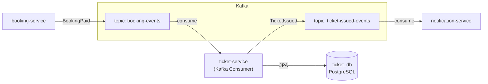

# Ticket Service — Design Document

## Overview

`ticket-service` is responsible for **issuing digital tickets**, **managing ticket lifecycle** (issued → checked-in → cancelled), and **verifying QR codes** at event entry points. It operates as a Kafka consumer for booking events and exposes REST APIs for ticket queries and check-ins.

---

## Architecture



---

## Domain Model

### `Ticket`

| Field | Type | Description |
|-------|------|-------------|
| `id` | Long | Primary key |
| `bookingId` | Long | Logical reference to booking (no FK) |
| `bookingItemId` | Long | Sub-item reference |
| `userId` | Long | Ticket owner |
| `customerEmail` | String | For notifications |
| `eventId` | Long | Logical reference to event |
| `eventTitle` | String | Snapshot (denormalized) |
| `ticketTypeId` | Long | Logical reference to ticket type |
| `ticketTypeName` | String | Snapshot (denormalized) |
| `ticketCode` | String | Unique human-readable code (e.g., `TICKET-ABCD-EFGH`) |
| `qrPayload` | String | HMAC-SHA256 signed payload for offline verification |
| `status` | TicketStatus | `ISSUED`, `CHECKED_IN`, `CANCELLED` |
| `issuedAt` | Instant | When the ticket was created |
| `checkedInAt` | Instant | When check-in occurred |

### `CheckinLog`

Audit trail for every scan attempt (valid, already checked-in, invalid, cancelled).

### `ProcessedEvent`

Idempotency guard for Kafka messages. Key format: `booking-paid-{bookingId}`. Unique constraint prevents duplicate processing.

### `EventSnapshot`

Local cache of event titles to avoid cross-service lookups when rendering tickets.

---

## Service Layer

### `TicketService`

| Method | Purpose |
|--------|---------|
| `issue(IssueRequest)` | Create N tickets for a booking item |
| `findAllPaginated(...)` | Query tickets by userId / eventId / bookingId |
| `statsForEvent(Long)` | Aggregated counts (issued, checked-in, cancelled) |
| `checkIn(CheckinRequest)` | Atomically mark a ticket as CHECKED_IN |
| `voidByBooking(Long)` | Cancel all tickets for a booking (Saga compensation) |
| `listCheckins(...)` | Audit logs for an event or set of events |

### Check-In Algorithm

1. **Verify QR signature** using `QrSigner` (HMAC-SHA256)
2. **Atomic conditional update** via JPQL:
   ```sql
   UPDATE Ticket t SET t.status = 'CHECKED_IN', t.checkedInAt = :now
   WHERE t.ticketCode = :code AND t.status = 'ISSUED'
   ```
3. If `updated == 1`, the caller won the race → `VALID`
4. If `updated == 0`, check current state → `ALREADY_CHECKED_IN`, `INVALID_TICKET`, or `CANCELLED_TICKET`
5. **Log the attempt** to `CheckinLog` for audit

This design handles concurrent scans of the same QR code safely without distributed locks.

### `QrSigner`

- Signs `ticketCode` with HMAC-SHA256 using a configurable secret
- Payload format: `base64(ticketCode):base64(signature)` (URL-safe, compact)
- Enables **offline verification**: a mobile check-in app can verify authenticity without internet (only needs the secret)
- Uses constant-time comparison to prevent timing attacks

---

## Kafka Integration

### Consumer: `BookingEventsConsumer`

- **Topic:** `booking-events`
- **Group ID:** `ticket-service`
- **Message type:** `BookingEventMessage`
- **Filtered events:** Only processes `eventType == "BookingPaid"`

**Processing flow:**
1. Check idempotency key (`booking-paid-{bookingId}`) in `ProcessedEvent`
2. If already processed → log and skip
3. For each booking item, call `TicketService.issue(...)`
4. After all tickets are persisted, publish `TicketsIssuedEventMessage` to `ticket-issued-events`
5. The publisher uses `TransactionSynchronization.afterCommit()` to ensure the DB transaction commits before Kafka send

### Producer: `TicketEventPublisher`

- **Topic:** `ticket-issued-events`
- **Message type:** `TicketsIssuedEventMessage`
- **Key:** `bookingId` (ensures ordering per booking)
- **Delivery:** Guaranteed after local DB transaction commit

---

## API Endpoints

| Method | Path | Auth | Description |
|--------|------|------|-------------|
| GET | `/api/tickets` | Any role | List own tickets (customers) or filtered query (staff/admin) |
| GET | `/api/tickets/stats` | ORGANIZER/STAFF/ADMIN | Stats per event |
| GET | `/api/tickets/{id}` | Any role | Get single ticket |
| POST | `/api/tickets` | ADMIN/ORGANIZER/STAFF | Manual ticket creation |
| POST | `/api/tickets/issue` | ADMIN/ORGANIZER/STAFF | Bulk issue tickets |
| PUT | `/api/tickets/{id}` | ADMIN/ORGANIZER/STAFF | Update ticket |
| DELETE | `/api/tickets/{id}` | ADMIN/ORGANIZER/STAFF | Delete ticket |
| POST | `/api/tickets/check-in` | ADMIN/ORGANIZER/STAFF | Check in by ticket code |
| POST | `/api/tickets/void` | INTERNAL/ADMIN/ORGANIZER/STAFF | Void all tickets for a booking |
| GET | `/api/checkins` | ADMIN/ORGANIZER/STAFF | Check-in logs |
| POST | `/api/checkins` | ADMIN/ORGANIZER/STAFF | Alias for check-in |

---

## Database Schema

```sql
-- tickets
CREATE TABLE tickets (
  id BIGSERIAL PRIMARY KEY,
  booking_id BIGINT,
  booking_item_id BIGINT,
  user_id BIGINT,
  customer_email VARCHAR(255),
  event_id BIGINT,
  event_title VARCHAR(500),
  ticket_type_id BIGINT,
  ticket_type_name VARCHAR(255),
  ticket_code VARCHAR(255) NOT NULL UNIQUE,
  qr_payload TEXT,
  status VARCHAR(20) NOT NULL DEFAULT 'ISSUED',
  issued_at TIMESTAMP,
  checked_in_at TIMESTAMP,
  created_at TIMESTAMP NOT NULL DEFAULT NOW(),
  updated_at TIMESTAMP
);

CREATE INDEX idx_ticket_user ON tickets(user_id);
CREATE INDEX idx_ticket_event ON tickets(event_id);

-- checkin_logs
CREATE TABLE checkin_logs (
  id BIGSERIAL PRIMARY KEY,
  ticket_id BIGINT,
  ticket_code VARCHAR(255),
  staff_id BIGINT,
  event_id BIGINT,
  result VARCHAR(50),
  message TEXT,
  checked_in_at TIMESTAMP,
  created_at TIMESTAMP NOT NULL DEFAULT NOW()
);

-- processed_events (idempotency)
CREATE TABLE processed_events (
  dedup_key VARCHAR(255) PRIMARY KEY,
  created_at TIMESTAMP NOT NULL DEFAULT NOW()
);

-- event_snapshots
CREATE TABLE event_snapshots (
  id BIGINT PRIMARY KEY,
  title VARCHAR(500),
  updated_at TIMESTAMP
);
```

---

## Security

- **JWT validation** via `common-security` library (gateway forwards `X-User-Id` and `X-User-Roles`)
- **Role-based access** via `@RequireRole`
- **Per-event authorization** for organizers: checks if the caller manages the event via `event-service` internal API
- **QR tamper-proofing** via HMAC signature
- **Concurrent check-in safety** via atomic database update

---

## Configuration

Key properties in `application.yml`:

| Property | Default | Description |
|----------|---------|-------------|
| `tickethub.qr.secret` | `tickethub-qr-secret-...` | HMAC key for QR signing |
| `tickethub.kafka.topic.booking-events` | `booking-events` | Input topic |
| `tickethub.kafka.topic.ticket-issued-events` | `ticket-issued-events` | Output topic |
| `spring.jpa.hibernate.ddl-auto` | `update` | Schema evolution |

---

## Idempotency & Reliability

- **Duplicate BookingPaid:** Guarded by `ProcessedEvent` with DB unique constraint. Same transaction as ticket issuance.
- **Kafka at-least-once:** Consumer may receive duplicates; idempotency key prevents double issuance.
- **Transaction outbox pattern:** `TicketEventPublisher` only sends Kafka message after the DB transaction commits.
- **Saga compensation:** `voidByBooking()` cancels all tickets for a refunded booking.
