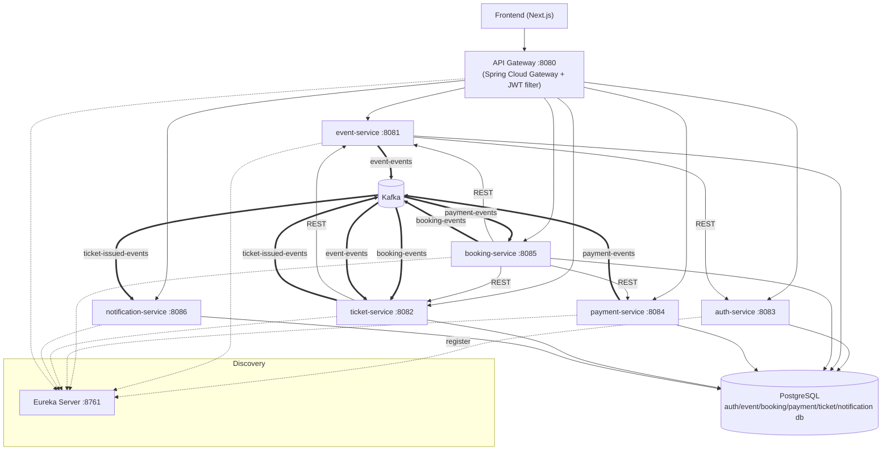

# 02 — Kiến trúc hệ thống

## Sơ đồ thành phần



Mũi tên nét liền là **REST đồng bộ**; mũi tên nét đôi là **Kafka bất đồng bộ**.

## Các khối xây dựng

| Mối quan tâm | Công nghệ |
|--------------|-----------|
| Dịch vụ | Spring Boot (Maven multi-module trong `backend/`) |
| API gateway | Spring Cloud Gateway (`api-gateway`) |
| Service discovery | Netflix Eureka (`eureka-server`) — dịch vụ đăng ký qua `lb://` |
| Messaging bất đồng bộ | Apache Kafka |
| Lưu trữ | PostgreSQL, mỗi dịch vụ một database |
| Xác thực | JWT (module dùng chung `common-security`) |
| Khả năng chịu lỗi | Resilience4j (circuit breaker + retry) |
| Tracing | Zipkin |
| Metrics | Prometheus (Micrometer) |
| Logs | Loki + Promtail |
| Dashboard | Grafana |
| Frontend | Next.js 14 (App Router) + Tailwind |

## Cổng (Port)

| Thành phần | Cổng |
|------------|------|
| API Gateway | 8080 |
| Eureka | 8761 |
| event-service | 8081 |
| ticket-service | 8082 |
| auth-service | 8083 |
| payment-service | 8084 |
| booking-service | 8085 |
| notification-service | 8086 |
| PostgreSQL | 5432 trong container / **5433** trên host |
| Kafka | 9092 |
| Grafana | 3000 |

## Định tuyến qua Gateway

Gateway là điểm vào công khai duy nhất. Nó **không** cắt bỏ tiền tố đường dẫn (path
prefix); route khớp theo tiền tố và chuyển tiếp qua cơ chế cân bằng tải của Eureka
(`lb://`):

| Route id | Điều kiện Path | Đích |
|----------|----------------|------|
| auth-service | `/api/auth/**` | `lb://auth-service` |
| event-service | `/api/events/**`, `/api/ticket-types/**`, `/api/organizers/**`, `/api/uploads/**` | `lb://event-service` |
| booking-service | `/api/bookings/**` | `lb://booking-service` |
| payment-service | `/api/payments/**` | `lb://payment-service` |
| ticket-service | `/api/tickets/**`, `/api/checkins/**` | `lb://ticket-service` |

Gateway cũng áp dụng bộ lọc xác thực JWT và CORS toàn cục (origin được phép là
`http://localhost:5173` và `http://localhost:4173`).

> Lưu ý: `notification-service` không được expose qua bảng route của gateway; nó chủ yếu
> là một consumer Kafka và expose endpoint đọc của mình trong nội bộ.

## Tái tạo hình ảnh kiến trúc

Để tái tạo file `docs/images/architecture.png` từ sơ đồ Mermaid ở trên, chạy các lệnh sau:

```bash
# 1. Trích xuất khối mermaid từ markdown sang file .mmd
sed -n '/^```mermaid/,/^```$/p' docs/02-architecture.md | sed '1d;$d' > /tmp/architecture.mmd

# 2. Cài đặt mermaid-cli (nếu chưa có)
npm install -g @mermaid-js/mermaid-cli@latest

# 3. Tạo ảnh PNG chất lượng cao với nền trắng
mmdc -i /tmp/architecture.mmd -o docs/images/architecture.png -b white -w 2400 -H 1800 -s 3
```

Các tùy chọn:
- `-b white`: nền trắng (đồng nhất với các ảnh khác trong docs/images)
- `-w 2400 -H 1800`: kích thước canvas (có thể điều chỉnh)
- `-s 3`: scale factor 3x để tăng độ phân giải cuối cùng
