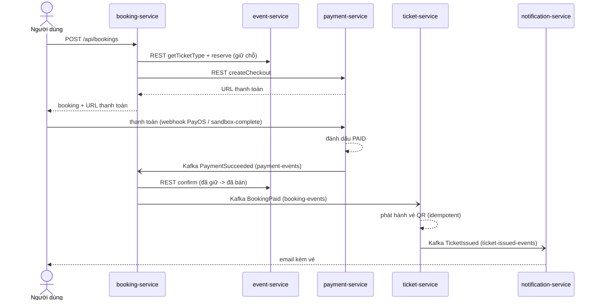
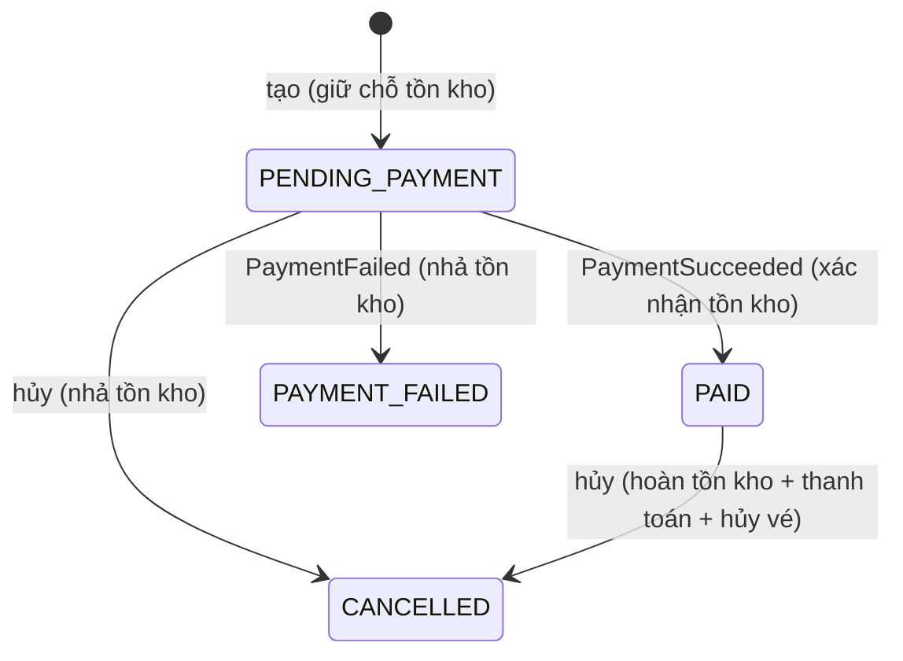

# 05 — Messaging & Saga

Giao tiếp bất đồng bộ sử dụng **Apache Kafka**. Sự kiện được phát kèm một khóa nghiệp vụ
(ví dụ `bookingId`, `eventId`, `ticketCode`) để mọi sự kiện của cùng một thực thể rơi vào
cùng một partition và giữ đúng thứ tự.

## Các topic

| Topic | Bên phát | Bên tiêu thụ | Loại thông điệp |
|-------|----------|--------------|------------------|
| `payment-events` | payment-service | booking-service (group `booking-service`) | `PaymentSucceeded`, `PaymentFailed`, `PaymentRefunded` |
| `booking-events` | booking-service | ticket-service (group `ticket-service`) | `BookingPaid`, `BookingCancelled` |
| `event-events` | event-service | ticket-service (group `ticket-service`) | sự kiện tạo/cập nhật, `EventDeleted` |
| `ticket-issued-events` | ticket-service | notification-service (group `notification-service`) | `TicketIssued` (gộp theo booking) |
| `ticket-events` | ticket-service | — (dành cho consumer tương lai) | vòng đời từng vé |

## Vì sao các luồng này là bất đồng bộ

**Quyết định** mua là đồng bộ (người dùng phải nhận lại URL thanh toán), nhưng mọi thứ
*sau khi* thanh toán đều là phản ứng chứ không phải request/response: nhà cung cấp thanh
toán không nên bị chặn trong lúc vé được tạo và email được gửi. Việc tách rời qua topic
cũng có nghĩa notification-service có thể được thêm/bớt mà không cần đụng tới ticket-service.

## Saga đặt vé — luồng thành công

## Luồng bù trừ / thất bại (saga kiểu choreography)

Vòng đời booking được điều phối bởi booking-service thông qua trạng thái cộng với các
hành động bù trừ — đây là **saga kiểu choreography**:

- **Thanh toán thất bại** → `PaymentFailed` → booking-service đặt `PAYMENT_FAILED` và gọi
  `eventClient.release` để trả lại chỗ đã giữ.
- **Hủy sau khi đã thanh toán** (`POST /api/bookings/{id}/cancel` trên booking `PAID`):
  `eventClient.refund` (trả tồn kho) → `paymentClient.refund` → `ticketClient.voidBooking`
  → phát `BookingCancelled`.
- **Hủy trước khi thanh toán** (`PENDING_PAYMENT`): chỉ `eventClient.release`.

## Đặc tính độ tin cậy

- **Consumer idempotent.** ticket-service bỏ qua việc phát hành nếu vé đã tồn tại cho
  booking (`ticketRepository.findByBookingId`). booking-service bảo vệ sự kiện thanh toán
  bằng bảng `ProcessedEvent` (`alreadyProcessed("pay-succeeded-" + paymentId)`), nên cơ
  chế giao nhận ít-nhất-một-lần (at-least-once) của Kafka không gây xử lý hai lần.
- **Sự kiện mang theo trạng thái (event-carried state).** `BookingPaid` mang theo toàn bộ
  danh sách mục, nên ticket-service không cần callback để bổ sung dữ liệu.
- **Sao chép cục bộ.** `event-events` cập nhật `EventSnapshot` của ticket-service, loại bỏ
  một phụ thuộc đồng bộ vào event-service tại thời điểm phát hành vé.

Xem [08 — Hạn chế](08-limitations.md) để biết về vấn đề dual-write/outbox và sự kiện
`PaymentRefunded` hiện chưa có consumer.
