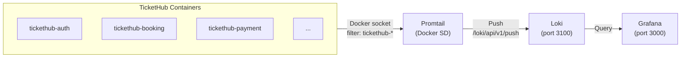
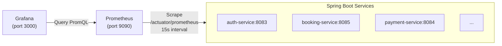
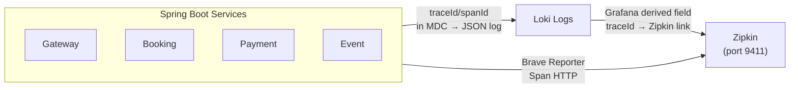

# Quan sát Hệ thống — Logging, Metrics & Tracing

TicketHub triển khai bộ quan sát (observability) **LGTM-P** đầy đủ trên Docker Compose để giám sát toàn bộ 8 microservice và hạ tầng:

| Thành phần | Công nghệ | Vai trò | Port |
|------------|-----------|---------|------|
| **Loki** | Grafana Loki | Lưu trữ log tập trung | `3100` |
| **Promtail** | Grafana Promtail | Thu thập log container đẩy vào Loki | — |
| **Grafana** | Grafana OSS | Dashboard hiển thị metrics + logs + trace | `3000` |
| **Prometheus** | Prometheus | Thu thập metrics từ `/actuator/prometheus` | `9090` |
| **Zipkin** | OpenZipkin | Distributed tracing (trace/span) | `9411` |

Các thành phần này được định nghĩa trong [`backend/docker-compose.yml`](../backend/docker-compose.yml) mục **Observability** (dòng 210–265).
Compose file dev ([`backend/docker-compose.dev.yml`](../backend/docker-compose.dev.yml)) **loại bỏ toàn bộ** observability để giảm tải laptop.

---

## 1. Centralized Logging (Loki + Promtail)

### 1.1 Kiến trúc



- **Promtail** mount Docker socket (`/var/run/docker.sock`) để tự động phát hiện container.
- Chỉ giữ lại container có tên khớp regex `tickethub-.*` (cấu hình `action: keep`).
- Gán nhãn: `container`, `stream` (stdout/stderr), `job=tickethub`, `level` (trích từ JSON log).

### 1.2 Điểm chính cấu hình Loki

File: [`backend/observability/loki-config.yml`](../backend/observability/loki-config.yml)

- **Storage**: local filesystem (`/tmp/loki/chunks`) — đơn giản cho dev, cần chuyển S3/GCS khi production.
- **Retention**: 7 ngày (`168h`); có thể tăng lên cho production.
- **Index**: TSDB schema v13, 24h period.
- **Limits**: ingestion rate `64 MB/s`, burst `128 MB/s` — tránh drop log khi dev khởi động lại.
- **Auth**: tắt (`auth_enabled: false`) cho local dev.

### 1.3 Điểm chính cấu hình Promtail

File: [`backend/observability/promtail-config.yml`](../backend/observability/promtail-config.yml)

- **Docker Service Discovery**: tự động phát hiện container mới mà không cần cấu hình static.
- **Relabel**: lấy tên container làm label `container`, gán `job=tickethub`, chỉ giữ container `tickethub-*`.
- **Multiline**: gộp stack trace Java thành 1 dòng log duy nhất (dòng đầu bắt đầu bằng `{`).
- **JSON parsing**: trích `level` từ log JSON ra thành label Loki để lọc nhanh (`{job="tickethub", level="ERROR"}`).

### 1.4 JSON Logging trong Service

Hai service `ticket-service` và `notification-service` đã cấu hình `logback-spring.xml` để xuất log dạng JSON:

File: [`backend/ticket-service/src/main/resources/logback-spring.xml`](../backend/ticket-service/src/main/resources/logback-spring.xml)

- **Logstash Encoder** (`net.logstash.logback.encoder.LogstashEncoder`) biến log thành JSON có cấu trúc.
- **Bao gồm `traceId` và `spanId`** từ MDC (do Micrometer Tracing tự động điền) — giúp correlating log với trace Zipkin.

Các service khác hiện chưa có `logback-spring.xml` riêng, nhưng đều có `logging.pattern.level` trong `application.yml` để in `traceId`/`spanId` dạng text:

```yaml
logging:
  pattern:
    level: "%5p [${spring.application.name:-},%X{traceId:-},%X{spanId:-}]"
```

### 1.5 Truy vấn Log trong Grafana

Dashboard provisioned: **TicketHub — Overview** → panel cuối cùng hiển thị log tất cả service.

Query mẫu:

```logql
# Tất cả log TicketHub
{job="tickethub"}

# Log lỗi của booking-service
{job="tickethub", container="tickethub-booking", level="ERROR"}

# Tìm theo traceId (nếu log JSON có chứa)
{job="tickethub"} |= "traceId=abc123"
```

---

## 2. Metrics (Prometheus + Micrometer)

### 2.1 Kiến trúc



### 2.2 Dependency trong Code

File: [`backend/pom.xml`](../backend/pom.xml) (parent POM, áp dụng cho **tất cả module**)

- **`micrometer-registry-prometheus`**: expose metrics định dạng Prometheus tại `/actuator/prometheus`.
- **`micrometer-tracing-bridge-brave`**: tích hợp Micrometer Tracing với Brave (Zipkin).
- **`zipkin-reporter-brave`**: gửi trace/span tới Zipkin.

Mỗi service con cũng khai báo riêng `spring-boot-starter-actuator`.  
Hai service `ticket-service` và `notification-service` thêm `logstash-logback-encoder` để xuất JSON log.

### 2.3 Điểm chính cấu hình Actuator

File: [`backend/booking-service/src/main/resources/application.yml`](../backend/booking-service/src/main/resources/application.yml) (các service khác tương tự)

- **`/actuator/prometheus`**: endpoint chính để Prometheus scrape.
- **`/actuator/health`**: kiểm tra sức khỏe service (dùng cho Docker healthcheck).
- **`/actuator/metrics`**: xem tất cả metrics có sẵn.
- **Expose endpoints**: `health,info,prometheus,metrics` (booking-service thêm `circuitbreakers,retries`).
- **Trace sampling**: `probability: 1.0` — ghi lại 100% request (dev); production nên giảm xuống `0.1`.
- **Zipkin endpoint**: gửi span tới `http://localhost:9411/api/v2/spans`.

### 2.4 Điểm chính cấu hình Prometheus Scrape

File: [`backend/observability/prometheus.yml`](../backend/observability/prometheus.yml)

- **Static config**: scrape 8 service trong Docker Compose theo tên container + port cố định.
- **Label `service`**: giúp phân biệt metrics theo từng microservice trong Grafana.
- **Scrape interval**: 15 giây.

### 2.5 Resilience4j Metrics

`booking-service` sử dụng **Resilience4j** circuit breaker + retry cho gọi liên service (`event`, `payment`).

- **`registerHealthIndicator: true`**: cập nhật `/actuator/health` khi circuit breaker mở.
- **Histogram**: bật `percentiles-histogram` cho `resilience4j.circuitbreaker.calls` để tính latency percentile.
- **Metrics tự động expose**: `resilience4j_circuitbreaker_state`, `resilience4j_circuitbreaker_failure_rate`, `resilience4j_circuitbreaker_calls_total`, ...

### 2.6 Grafana Dashboard

File dashboard: [`backend/observability/grafana/dashboards/tickethub-overview.json`](../backend/observability/grafana/dashboards/tickethub-overview.json)

Dashboard được **provision tự động** khi Grafana khởi động qua:

- [`backend/observability/grafana/provisioning/datasources/datasources.yml`](../backend/observability/grafana/provisioning/datasources/datasources.yml)
- [`backend/observability/grafana/provisioning/dashboards/dashboards.yml`](../backend/observability/grafana/provisioning/dashboards/dashboards.yml)

Các panel chính:

| Panel | Datasource | Query / Mô tả |
|-------|------------|---------------|
| **Services UP** | Prometheus | `count(up{job="tickethub-services"} == 1)` |
| **HTTP request rate** | Prometheus | `sum by (service) (rate(http_server_requests_seconds_count[1m]))` |
| **Latency p95** | Prometheus | `histogram_quantile(0.95, sum by (service, le) (rate(http_server_requests_seconds_bucket[5m])))` |
| **JVM heap used** | Prometheus | `sum by (service) (jvm_memory_used_bytes{area="heap"})` |
| **Circuit breaker state** | Prometheus | `resilience4j_circuitbreaker_state` |
| **Circuit breaker failure rate** | Prometheus | `resilience4j_circuitbreaker_failure_rate` |
| **Logs (tất cả service)** | Loki | `{job="tickethub"}` |

---

## 3. Distributed Tracing (Zipkin)



- **Zipkin** chạy tại `http://localhost:9411`.
- Mỗi service gửi span qua biến môi trường `ZIPKIN_ENDPOINT` (xem [`docker-compose.yml`](../backend/docker-compose.yml)).
- **TraceId** được tự động sinh bởi Micrometer Tracing và in ra log (qua MDC), giúp:
  - Tìm log liên quan đến một request đi qua nhiều service.
  - Grafana datasource Loki có **derived field** `traceId` — click để nhảy sang Zipkin UI xem flamegraph.

---

## 4. Truy cập & Sử dụng

### 4.1 Khởi động toàn bộ stack

```bash
cd backend
docker compose up -d --build
```

### 4.2 Truy cập UI

| Công cụ | URL | Mặc định |
|---------|-----|----------|
| Grafana | http://localhost:3000 | `admin` / `admin` (hoặc anonymous viewer) |
| Prometheus | http://localhost:9090 | — |
| Zipkin | http://localhost:9411 | — |
| Loki API | http://localhost:3100 | — |

### 4.3 Dev mode (không có observability)

```bash
docker compose -f docker-compose.yml -f docker-compose.dev.yml up -d --build
```

Lúc này **không** có Loki, Promtail, Grafana, Prometheus, Zipkin.

---

## 5. Tóm tắt Cấu hình trong Codebase

| File | Mục đích |
|------|----------|
| `backend/docker-compose.yml` | Định nghĩa container Loki, Promtail, Grafana, Prometheus, Zipkin |
| `backend/observability/loki-config.yml` | Cấu hình Loki (storage, retention, limits) |
| `backend/observability/promtail-config.yml` | Cấu hình Promtail (Docker SD, filter, multiline, JSON parse) |
| `backend/observability/prometheus.yml` | Scrape config cho 8 service |
| `backend/observability/grafana/provisioning/...` | Datasource + dashboard auto-provision |
| `backend/pom.xml` | Parent dependencies: Micrometer Prometheus, Brave tracing, Zipkin reporter |
| `backend/*/pom.xml` | `spring-boot-starter-actuator` + `logstash-logback-encoder` (một số service) |
| `backend/*/src/main/resources/application.yml` | Expose actuator endpoints, tracing sampling, Zipkin endpoint |
| `backend/ticket-service/.../logback-spring.xml` | JSON log với traceId/spanId |
| `backend/notification-service/.../logback-spring.xml` | JSON log với traceId/spanId |

---

## 6. Ghi chú Production

- **Loki storage**: chuyển từ `filesystem` sang S3/MinIO/GCS và dùng BoltDB-Shipper hoặc TSDB trên object store.
- **Retention**: tăng `retention_period` từ `168h` lên `720h` (30 ngày) hoặc hơn.
- **Trace sampling**: giảm `probability` từ `1.0` xuống `0.1` để giảm tải Zipkin.
- **Promtail**: thay vì Docker SD, có thể dùng Kubernetes SD khi chạy trên K8s.
- **Security**: bật `auth_enabled: true` trên Loki và cấu hình TLS cho Grafana/Prometheus.
